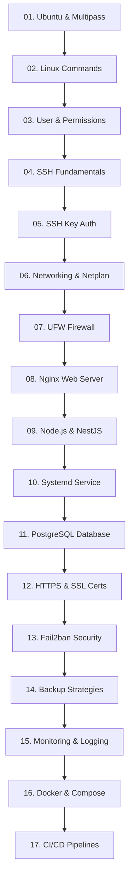

# 🐧 Hướng Dẫn Học Tập & Thực Hành Ubuntu Server với Multipass trên macOS

Chào mừng bạn đến với bộ tài liệu thực hành và làm chủ **Ubuntu Server** dành cho người dùng **macOS** sử dụng công cụ ảo hóa nhẹ **Multipass** (phát triển bởi Canonical).

---

## 🎯 1. Mục Tiêu Bộ Tài Liệu

Bộ tài liệu này được thiết kế theo hướng **thực hành thực chiến (hands-on)**, giúp bạn:
- Nắm vững từ nền tảng quản trị hệ điều hành Linux/Ubuntu Server đến việc tự xây dựng hạ tầng production hoàn chỉnh.
- Sử dụng **Multipass** trên macOS để tạo và quản lý các máy ảo Ubuntu Server nhanh chóng, tiêu tốn ít tài nguyên và dễ dàng tái lập môi trường.
- Triển khai toàn diện một ứng dụng Backend hiện đại (**NestJS + PostgreSQL + Nginx**) với đầy đủ cơ chế bảo mật (SSH Key, UFW, Fail2ban, HTTPS/SSL), giám sát (Monitoring/Logging), quản lý dịch vụ (systemd), container hóa (Docker) và tự động hóa triển khai (CI/CD).

---

## 💻 2. Môi Trường & Công Cụ

- **Host OS:** macOS (Apple Silicon M1/M2/M3/M4 & Intel x86_64).
- **Virtualization Engine:** **[Multipass](https://multipass.run/)** – Công cụ tạo máy ảo Ubuntu siêu tốc của Canonical, sử dụng Hypervisor nguyên bản của macOS (`hyperkit` / `qemu`).
- **Guest OS:** Ubuntu Server LTS (22.04 Jammy Jellyfish / 24.04 Noble Numbat).
- **Công cụ kết nối:** macOS Terminal / iTerm2, OpenSSH, VS Code (Remote - SSH).

---

## 🚀 3. Hướng Dẫn Bắt Đầu Nhanh (Quickstart)

### Bước 1: Cài đặt Multipass trên macOS
```bash
brew install --cask multipass
```
Kiểm tra phiên bản sau khi cài đặt:
```bash
multipass version
```

### Bước 2: Khởi tạo máy ảo Ubuntu Server đầu tiên
Tạo một máy ảo Ubuntu 24.04 LTS với cấu hình 2 CPU, 2GB RAM và 10GB ổ cứng:
```bash
multipass launch 24.04 --name ubuntu-lab --cpus 2 --memory 2G --disk 10G
```

### Bước 3: Truy cập và quản lý Server
- **Truy cập shell trực tiếp:**
  ```bash
  multipass shell ubuntu-lab
  ```
- **Kiểm tra danh sách máy ảo đang chạy & địa chỉ IP:**
  ```bash
  multipass list
  ```
- **Mount thư mục từ máy Mac vào máy ảo (để chia sẻ code/tài liệu):**
  ```bash
  multipass mount ~/Documents/learn/ubuntu-server ubuntu-lab:/home/ubuntu/workspace
  ```

---

## 🗺️ 4. Sơ Đồ Lộ Trình Tổng Quan (17 Giai Đoạn)



---

## 📚 5. Nội Dung Chi Tiết 17 Phần Học Tập & Thực Hành

---

### 📍 [Phần 01: Ubuntu & Multipass Setup](./docs/01-ubuntu.md)
* **Nội dung lý thuyết:**
  - Khái niệm Linux Kernel, bản phân phối (Distro) Ubuntu và các phiên bản LTS (Long Term Support).
  - So sánh Multipass với VirtualBox, VMware, Docker: Cơ chế Native Hypervisor trên macOS.
  - Vòng đời máy ảo (VM Lifecycle) và quản lý tài nguyên (CPU, RAM, Disk).
* **Thực hành chính:**
  - Khởi tạo, dừng, bật lại, xóa và dọn dẹp máy ảo: `launch`, `stop`, `start`, `delete`, `purge`.
  - Kiểm tra tài nguyên và thông tin phần cứng với `multipass info <vm-name>`.
  - Mount và Unmount thư mục giữa macOS và máy ảo Ubuntu Server.
  - Sử dụng Cloud-Init để bootstrap máy ảo tự động khi khởi tạo.

---

### 📍 [Phần 02: Linux Commands (Lệnh Linux Cốt Lõi)](./docs/02-linux-commands.md)
* **Nội dung lý thuyết:**
  - Cấu trúc hệ thống tập tin Linux Filesystem Hierarchy Standard (FHS: `/`, `/etc`, `/var`, `/home`, `/usr`, `/opt`).
  - Đường dẫn tuyệt đối (Absolute) vs Đường dẫn tương đối (Relative).
  - Luồng chuẩn I/O (Standard Input, Output, Error) và cơ chế Redirection / Pipe (`|`, `>`, `>>`, `2>&1`).
* **Thực hành chính:**
  - Điều hướng và thao tác tệp: `cd`, `pwd`, `ls -la`, `mkdir -p`, `touch`, `cp -r`, `mv`, `rm -rf`.
  - Xem và xử lý nội dung văn bản: `cat`, `less`, `head`, `tail -f`, `grep -rnw`, `wc`.
  - Tìm kiếm và lọc tệp: `find / -name "*.conf"`, `which`, `whereis`.
  - Nén và giải nén tệp: `tar -czvf archive.tar.gz folder/`, `tar -xzvf archive.tar.gz`.
  - Soạn thảo văn bản trực tiếp trong terminal với `nano` hoặc `vim`.

---

### 📍 [Phần 03: User & Permission (Quản Lý Người Dùng & Phân Quyền)](./docs/03-user-permission.md)
* **Nội dung lý thuyết:**
  - Mô hình bảo mật đa người dùng của Linux (UID, GID).
  - Nguyên tắc đặc quyền tối thiểu (Principle of Least Privilege) & quyền hạn của Superuser `root`.
  - Bảng mã phân quyền tập tin `rwx` (Read = 4, Write = 2, Execute = 1) cho Owner, Group, Others.
* **Thực hành chính:**
  - Quản lý User/Group: `useradd -m -s /bin/bash devops`, `passwd devops`, `usermod -aG sudo devops`, `userdel -r`.
  - Cấu hình sudo an toàn qua `visudo` và file `/etc/sudoers.d/`.
  - Phân quyền tệp tin và thư mục: `chmod 755`, `chmod 600`, `chmod 644`, `chown -R devops:devops /var/www/`.
  - Tìm hiểu quyền đặc biệt: SUID, SGID và Sticky Bit (`chmod +t /tmp`).

---

### 📍 [Phần 04: SSH Fundamentals (Nền Tảng Giao Thức SSH)](./docs/04-ssh.md)
* **Nội dung lý thuyết:**
  - Cơ chế hoạt động của giao thức Secure Shell (Port mặc định 22).
  - Kiến trúc Client-Server (macOS OpenSSH Client -> Ubuntu `sshd` Service).
  - File cấu hình máy chủ SSH: `/etc/ssh/sshd_config`.
* **Thực hành chính:**
  - Kết nối trực tiếp từ macOS Terminal vào máy ảo bằng địa chỉ IP: `ssh username@<IP_MULTIPASS>`.
  - Kiểm tra trạng thái và khởi động lại dịch vụ SSH: `sudo systemctl status ssh`, `sudo systemctl restart ssh`.
  - Cấu hình các tham số bảo mật cơ bản: Đổi cổng SSH mặc định (vd: 2222), giới hạn thời gian chờ `ClientAliveInterval`.

---

### 📍 [Phần 05: SSH Key Authentication (Xác Thực SSH Bằng Khóa)](./docs/05-ssh-key.md)
* **Nội dung lý thuyết:**
  - Mật mã học bất đối xứng: Private Key (giữ bí mật trên Mac) & Public Key (đặt trên Ubuntu Server).
  - So sánh các thuật toán mã hóa khóa: `ED25519` (hiện đại, an toàn, nhanh) vs `RSA 4096`.
  - Cơ chế `~/.ssh/authorized_keys`.
* **Thực hành chính:**
  - Tạo SSH Key Pair trên macOS: `ssh-keygen -t ed25519 -C "admin@macbook"`.
  - Chuyển Public Key lên Ubuntu Server bằng lệnh `ssh-copy-id -i ~/.ssh/id_ed25519.pub username@<IP>`.
  - Vô hiệu hóa đăng nhập bằng mật khẩu (`PasswordAuthentication no`) và vô hiệu hóa root login (`PermitRootLogin no`) trong `/etc/ssh/sshd_config`.
  - Thiết lập file cấu hình `~/.ssh/config` trên máy Mac để đăng nhập 1 chạm (`ssh myserver`).

---

### 📍 [Phần 06: Networking (Quản Trị Mạng & Netplan)](./docs/06-networking.md)
* **Nội dung lý thuyết:**
  - Khái niệm địa chỉ IP (IPv4/IPv6), Subnet Mask, Gateway, DNS, Port, Localhost/Loopback.
  - Công cụ cấu hình mạng hiện đại trên Ubuntu: **Netplan** (YAML format trong `/etc/netplan/`).
  - Giao tiếp mạng giữa máy Host macOS và Multipass VM (Bridge / NAT / Host-only).
* **Thực hành chính:**
  - Kiểm tra card mạng và IP: `ip a`, `ip route`, `ip neigh`.
  - Chẩn đoán kết nối và phân giải tên miền: `ping`, `traceroute`, `curl -I`, `dig`, `resolvectl status`.
  - Kiểm tra cổng và dịch vụ đang lắng nghe: `ss -tulpn`, `lsof -i :80`, `netstat -plnt`.
  - Cấu hình IP tĩnh cho máy ảo thông qua Netplan (`netplan apply`).

---

### 📍 [Phần 07: UFW Firewall (Cấu Hình Tường Lửa)](./docs/07-ufw-firewall.md)
* **Nội dung lý thuyết:**
  - **UFW (Uncomplicated Firewall)**: Giao diện quản lý tường lửa thân thiện trên nền tảng `iptables` / `nftables`.
  - Nguyên tắc thiết lập Firewall an toàn: "Default Deny All Incoming, Allow All Outgoing".
* **Thực hành chính:**
  - Thiết lập chính sách mặc định: `sudo ufw default deny incoming`, `sudo ufw default allow outgoing`.
  - Mở các cổng dịch vụ cần thiết: `sudo ufw allow 22/tcp` (hoặc port SSH tùy chỉnh), `sudo ufw allow 80/tcp`, `sudo ufw allow 443/tcp`.
  - Kích hoạt, kiểm tra và quản lý quy tắc: `sudo ufw enable`, `sudo ufw status verbose`, `sudo ufw status numbered`, `sudo ufw delete <rule-number>`.
  - Giới hạn tốc độ kết nối chống quét cổng/spam: `sudo ufw limit ssh`.

---

### 📍 [Phần 08: Nginx (Web Server & Reverse Proxy)](./docs/08-nginx.md)
* **Nội dung lý thuyết:**
  - Vai trò của Nginx: Web Server tĩnh, Reverse Proxy, Load Balancer, SSL Termination.
  - Cấu trúc thư mục `/etc/nginx/`: `nginx.conf`, `conf.d/`, `sites-available/`, `sites-enabled/`.
  - Khái niệm Server Block (Virtual Host), Directives `location`, `root`, `index`, `proxy_pass`.
* **Thực hành chính:**
  - Cài đặt Nginx qua APT: `sudo apt update && sudo apt install nginx -y`.
  - Tạo Server Block phục vụ trang web tĩnh tại `/var/www/html/`.
  - Cấu hình Nginx làm Reverse Proxy chuyển tiếp traffic tới ứng dụng Backend (Node.js/NestJS chạy cổng 3000):
    ```nginx
    location /api/ {
        proxy_pass http://127.0.0.1:3000/;
        proxy_set_header Host $host;
        proxy_set_header X-Real-IP $remote_addr;
        proxy_set_header X-Forwarded-For $proxy_add_x_forwarded_for;
        proxy_set_header X-Forwarded-Proto $scheme;
    }
    ```
  - Kiểm tra cú pháp và nạp lại cấu hình không gián đoạn: `sudo nginx -t && sudo systemctl reload nginx`.

---

### 📍 [Phần 09: Node.js / NestJS (Môi Trường Thực Thi Backend)](./docs/09-nodejs-nestjs.md)
* **Nội dung lý thuyết:**
  - Node.js Runtime Engine & Quản lý gói (`npm`, `pnpm`, `yarn`).
  - Quản lý đa phiên bản Node.js với `nvm` hoặc NodeSource Repository chính thức.
  - Vòng đời ứng dụng NestJS: TypeScript compilation -> Production build (`dist/main.js`).
* **Thực hành chính:**
  - Cài đặt Node.js LTS (v20 / v22) trên Ubuntu Server.
  - Tạo hoặc tải ứng dụng NestJS mẫu lên server.
  - Cài đặt dependencies và build dự án: `npm ci && npm run build`.
  - Quản lý biến môi trường an toàn với file `.env.production`.
  - Chạy thử nghiệm app và kiểm tra endpoint qua `curl http://localhost:3000`.

---

### 📍 [Phần 10: Systemd (Quản Lý Tiến Trình & Dịch Vụ Nền)](./docs/10-systemd.md)
* **Nội dung lý thuyết:**
  - Hệ thống khởi tạo Systemd và vai trò của Init Process (PID 1).
  - Khái niệm Unit, Service, Target, Timer trong Systemd.
  - Vì sao cần Systemd cho ứng dụng Node/NestJS thay vì chạy trực tiếp bằng terminal.
* **Thực hành chính:**
  - Viết file Service Unit cho ứng dụng NestJS: `/etc/systemd/system/nestjs-app.service`:
    ```ini
    [Unit]
    Description=NestJS Production Backend
    After=network.target postgresql.service

    [Service]
    Type=simple
    User=devops
    WorkingDirectory=/home/devops/apps/nestjs-app
    ExecStart=/usr/bin/node dist/main.js
    Restart=always
    RestartSec=5
    EnvironmentFile=/home/devops/apps/nestjs-app/.env

    [Install]
    WantedBy=multi-user.target
    ```
  - Nạp cấu hình và kích hoạt tự khởi động cùng hệ thống:
    ```bash
    sudo systemctl daemon-reload
    sudo systemctl enable --now nestjs-app
    ```
  - Theo dõi trạng thái và kiểm tra log dịch vụ theo thời gian thực:
    ```bash
    sudo systemctl status nestjs-app
    journalctl -u nestjs-app -f -n 100
    ```

---

### 📍 [Phần 11: PostgreSQL (Hệ Quản Trị Cơ Sở Dữ Liệu)](./docs/11-postgresql.md)
* **Nội dung lý thuyết:**
  - Kiến trúc PostgreSQL Server & Database Cluster.
  - Quản lý người dùng, mật khẩu, database và quyền truy cập (Role & Privileges).
  - Tệp cấu hình mạng & bảo mật: `postgresql.conf` (listen_addresses) và `pg_hba.conf` (xác thực `md5`/`scram-sha-256`).
* **Thực hành chính:**
  - Cài đặt PostgreSQL: `sudo apt install postgresql postgresql-contrib -y`.
  - Đăng nhập vào PostgreSQL CLI: `sudo -u postgres psql`.
  - Tạo User, Database và cấp quyền cho ứng dụng NestJS:
    ```sql
    CREATE DATABASE nest_prod_db;
    CREATE USER nest_user WITH ENCRYPTED PASSWORD 'StrongPassword123!';
    GRANT ALL PRIVILEGES ON DATABASE nest_prod_db TO nest_user;
    \c nest_prod_db
    GRANT ALL ON SCHEMA public TO nest_user;
    ```
  - Cấu hình chuỗi kết nối `DATABASE_URL` trong NestJS (TypeORM/Prisma) và chạy migration.
  - Xuất và nhập dữ liệu (Backup & Restore DB): `pg_dump -U nest_user nest_prod_db > backup.sql`.

---

### 📍 [Phần 12: HTTPS / SSL (Mã Hóa & Chứng Chỉ Bảo Mật)](./docs/12-https-ssl.md)
* **Nội dung lý thuyết:**
  - Cơ chế hoạt động của SSL/TLS Handshake và mã hóa bất đối xứng trên Web.
  - Chứng chỉ số Certificate Authority (CA): Let's Encrypt vs Chứng chỉ tự ký (Self-Signed).
  - Chuyển hướng toàn bộ traffic từ HTTP (Port 80) sang HTTPS (Port 443).
* **Thực hành chính:**
  - **Môi trường Local Lab trên Multipass:** Tạo chứng chỉ Self-Signed với OpenSSL hoặc mkcert để test HTTPS cục bộ trên macOS:
    ```bash
    sudo openssl req -x509 -nodes -days 365 -newkey rsa:2048 \
      -keyout /etc/ssl/private/nginx-selfsigned.key \
      -out /etc/ssl/certs/nginx-selfsigned.crt
    ```
  - **Môi trường Production (Có Domain):** Cài đặt Certbot và tự động cấu hình Nginx với Let's Encrypt:
    ```bash
    sudo apt install certbot python3-certbot-nginx -y
    sudo certbot --nginx -d yourdomain.com
    ```
  - Cấu hình chuẩn TLS 1.2/1.3, HTTP/2 và kiểm tra tiến trình tự động gia hạn chứng chỉ (`certbot renew --dry-run`).

---

### 📍 [Phần 13: Fail2ban (Chống Tấn Công Dò Quét & Brute-force)](./docs/13-fail2ban.md)
* **Nội dung lý thuyết:**
  - Nguyên lý hoạt động của Fail2ban: Quét log file hệ thống, phát hiện các mẫu đăng nhập thất bại và tự động thêm rule cấm IP vào tường lửa.
  - Các thành phần: Jails, Filters (Regex), Actions.
  - Phân tách cấu hình chuẩn: `jail.conf` (mặc định) -> `jail.local` (tùy biến).
* **Thực hành chính:**
  - Cài đặt: `sudo apt install fail2ban -y`.
  - Tạo cấu hình bảo vệ SSH & Nginx tại `/etc/fail2ban/jail.local`:
    ```ini
    [DEFAULT]
    bantime = 1h
    findtime = 10m
    maxretry = 5

    [sshd]
    enabled = true
    port = ssh

    [nginx-http-auth]
    enabled = true
    ```
  - Kiểm tra trạng thái các jail: `sudo fail2ban-client status sshd`.
  - Thực hành gỡ lệnh cấm cho IP (Unban): `sudo fail2ban-client set sshd unbanip <IP_ADDRESS>`.

---

### 📍 [Phần 14: Backup (Chiến Lược & Tự Động Hóa Sao Lưu)](./docs/14-backup.md)
* **Nội dung lý thuyết:**
  - Nguyên tắc sao lưu 3-2-1 trong quản trị hệ thống.
  - Phân loại Backup: Full Backup, Differential Backup, Incremental Backup.
  - Định dạng nén, mã hóa bản backup và cơ chế tự dọn dẹp (Retention Policy).
* **Thực hành chính:**
  - Viết Bash Script tự động dump PostgreSQL Database, nén thư mục source code/uploads và lưu vào thư mục `/backups/`.
  - Đặt lịch định kỳ tự động chạy sao lưu hàng ngày lúc 02:00 AM qua Cronjob:
    ```bash
    crontab -e
    # 0 2 * * * /home/devops/scripts/backup-all.sh >> /var/log/backup.log 2>&1
    ```
  - Đồng bộ bản sao lưu an toàn về máy Mac qua `rsync` hoặc lên Cloud Storage qua `rclone`.

---

### 📍 [Phần 15: Monitoring & Logging (Giám Sát & Ghi Log Hệ Thống)](./docs/15-monitoring-logging.md)
* **Nội dung lý thuyết:**
  - Bốn trụ cột giám sát: CPU, RAM, Disk I/O, Network Throughput.
  - Vị trí và ý nghĩa các file log quan trọng: `/var/log/syslog`, `/var/log/auth.log`, `/var/log/nginx/`.
  - Cơ chế xoay vòng và dọn dẹp log với `logrotate` (`/etc/logrotate.d/`).
* **Thực hành chính:**
  - Sử dụng các công cụ CLI giám sát tài nguyên tức thì: `htop`, `glances`, `vmstat 1`, `iostat`, `ncdu`.
  - Truy vấn log chuyên sâu với `journalctl`: `journalctl -p err`, `journalctl --since "1 hour ago"`.
  - Cài đặt bảng điều khiển giám sát thời gian thực nhẹ nhàng với **Netdata** hoặc **Prometheus + Node Exporter + Grafana**.

---

### 📍 [Phần 16: Docker & Containerization (Đóng Gói Ứng Dụng)](./docs/16-docker.md)
* **Nội dung lý thuyết:**
  - Khái niệm Container vs Virtual Machine (Multipass là VM, Docker là Container chạy bên trong VM).
  - Các thành phần cốt lõi: Docker Engine, Dockerfile, Image, Container, Volume, Network.
* **Thực hành chính:**
  - Cài đặt Docker Engine & Docker Compose chính thống từ repository của Docker trên Ubuntu.
  - Viết `Dockerfile` tối ưu Multi-stage build cho ứng dụng NestJS để giảm kích thước image.
  - Viết `docker-compose.yml` điều phối toàn bộ stack: NestJS + PostgreSQL + Redis + Nginx Reverse Proxy:
    ```yaml
    services:
      app:
        build: .
        restart: always
        environment:
          DATABASE_URL: postgres://user:pass@db:5432/nestdb
        depends_on:
          - db

      db:
        image: postgres:16-alpine
        restart: always
        volumes:
          - pgdata:/var/lib/postgresql/data
        environment:
          POSTGRES_DB: nestdb
          POSTGRES_USER: user
          POSTGRES_PASSWORD: pass

    volumes:
      pgdata:
    ```
  - Quản lý tài nguyên container: `docker compose up -d`, `docker ps`, `docker logs -f`, `docker system prune`.

---

### 📍 [Phần 17: CI/CD (Tự Động Hóa Tích Hợp & Triển Khai)](./docs/17-cicd.md)
* **Nội dung lý thuyết:**
  - Chu trình CI/CD: Code -> Test -> Build -> Deploy -> Health Check.
  - So sánh các phương pháp triển khai: Push-based (SSH Action) vs Pull-based (Self-Hosted Runner, Webhook).
  - Quản lý bảo mật thông tin nhạy cảm qua GitHub Secrets / Environment Variables.
* **Thực hành chính:**
  - **Phương án 1 (SSH Deploy Action):** Tạo GitHub Actions Workflow tự động SSH vào server qua SSH Key, kéo code mới nhất từ Git, cài đặt packages, build và restart systemd/docker.
  - **Phương án 2 (GitHub Actions Self-Hosted Runner):** Cài đặt runner agent trực tiếp trên máy ảo Multipass để chạy pipeline nội bộ.
  - Triển khai chiến lược Zero-downtime deployment đơn giản và cấu hình thông báo trạng thái deploy qua Telegram/Discord Webhook.

---

## 🗂️ 6. Cấu Trúc Thư Mục Repository

```text
ubuntu-server/
├── README.md                           # Tổng quan & Lộ trình 17 phần
├── docs/                               # 17 Tài liệu hướng dẫn chi tiết
│   ├── 01-ubuntu.md
│   ├── 02-linux-commands.md
│   ├── 03-user-permission.md
│   ├── 04-ssh.md
│   ├── 05-ssh-key.md
│   ├── 06-networking.md
│   ├── 07-ufw-firewall.md
│   ├── 08-nginx.md
│   ├── 09-nodejs-nestjs.md
│   ├── 10-systemd.md
│   ├── 11-postgresql.md
│   ├── 12-https-ssl.md
│   ├── 13-fail2ban.md
│   ├── 14-backup.md
│   ├── 15-monitoring-logging.md
│   ├── 16-docker.md
│   └── 17-cicd.md
├── cloud-init/                         # Template khởi tạo máy ảo tự động
│   └── lab-bootstrap.yaml
├── configs/                            # Các file cấu hình mẫu
│   ├── nginx/
│   │   └── nestjs-app.conf
│   ├── systemd/
│   │   └── nestjs-app.service
│   ├── fail2ban/
│   │   └── jail.local
│   └── docker/
│       └── docker-compose.yml
├── scripts/                            # Shell scripts tự động hóa
│   ├── setup-server.sh
│   ├── setup-ssh-keys.sh
│   └── backup-database.sh
└── labs/                               # Mã nguồn thực hành mẫu
    └── sample-nestjs-app/
```

---

## ⚡ 7. Bảng Tra Cứu Nhanh Lệnh Multipass (Cheat Sheet)

| Lệnh | Mô tả chi tiết |
| :--- | :--- |
| `multipass launch 24.04 --name <name> --cpus 2 --memory 2G --disk 10G` | Tạo máy ảo Ubuntu 24.04 mới với cấu hình tùy chọn |
| `multipass list` | Liệt kê tất cả máy ảo kèm địa chỉ IP và trạng thái |
| `multipass shell <name>` | Đăng nhập trực tiếp vào terminal của máy ảo |
| `multipass exec <name> -- <command>` | Thực thi một câu lệnh trên máy ảo từ máy Mac |
| `multipass info <name>` | Xem chi tiết thông số phần cứng, RAM, ổ đĩa, IP của máy ảo |
| `multipass stop <name>` / `multipass start <name>` | Dừng / Bật lại máy ảo |
| `multipass restart <name>` | Khởi động lại máy ảo |
| `multipass delete <name>` | Đánh dấu xóa máy ảo |
| `multipass purge` | Xóa vĩnh viễn toàn bộ các máy ảo đã đánh dấu xóa |
| `multipass mount <mac_path> <name>:<vm_path>` | Gắn thư mục từ máy Mac vào máy ảo Ubuntu |
| `multipass unmount <name>:<vm_path>` | Hủy gắn thư mục |

---

## 💡 Hướng Dẫn Bắt Đầu
Hãy bắt đầu theo thứ tự từ **[01. Ubuntu & Multipass](./docs/01-ubuntu.md)** để khởi tạo môi trường thực hành đầu tiên!

